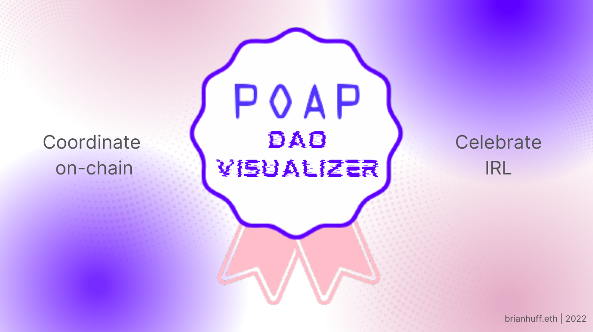

# <b>POAP NFT Visualizer</b>

A NFT visualizer for DAOs, specifically focused on POAPs.

# Description:

Being in and contributing to several DAOs over the past year, one of the coolest applications I have seen of decentralized governance is with Snapshot voting where as soon as you vote, you can mint a POAP NFT of your participation in the web3 voting experience. You can also receive POAPs and NFTs for attending events, meetups, Twitter Spaces, Clubhouse rooms, online conferences, community calls, and the list just goes on and on.

The amount of NFTs one could theoretically get via a DAO can be immense, so wouldn't it be optimal to have an NFT visualizer of these POAP collections, all in one place, simply by logging in via your web3 wallet.

POAP DAO Visualizer is a weekend hack designed to explore new tools in web3 and ultimately show DAO members how much they have contributed to their organization, membership, and in furthering the web3 community overall.

I hope you like my dapp 😊

# Tech Stack:

- Front-End: NEXTjs with TypeScript
- Data Layer / API: The Graph Protocol + GraphQL
- Back-End: Ethers.js (Web3 API) + Solidity (Smart Contracts) + Moralis (Web3 Database + Hooks)
- Blockchain: xDai (Gnosis) Chain + POAP (Proof of Attendance Protocol)

# Getting Started

Step #1: Install all of the dependencies:

```bash
npm i
# or
npm install
```

Step #2: Add in requisite environemntal variables

Step #3: Run the development server:

```bash
npm run dev
# or
yarn dev
```

Open [http://localhost:3000](http://localhost:3000) with your browser to see the result.

You can start editing the page by modifying `pages/index.tsx`. The page auto-updates as you edit the file.

# Want to contribute? 😊

Let's connect on Twitter [@BrianHHough](https://twitter.com/brianhhough)
