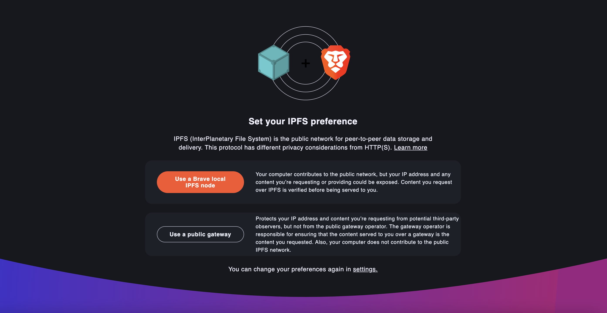

# IPFS (Inter-Planetary File System)

## Description:

A peer-to-peer hypermedia network and protocol to make the web faster, safer, and more open.

## Benefits:

- addresses data by "what it is" rather than where it's located on the network and who's hosting it
- performance advantages for loading content over its geographically-distributed network
- improved bandwidth by leveraging data deduplication
- decentralization
- data integrity
- censorship-resistant

## Two ways to connect to IPFS:

- <b>public gateway:</b> if you have limited system resources and JUST want to access content from your computer
- <b>install/run a local IPFS node:</b> allows you to access previously viewed IPFS content offline; and you can always verify content/requests with your local node; and contribute to the strength of the IPFS network with the `go.ipfs` component - routes future traffic through this component in Brave.

