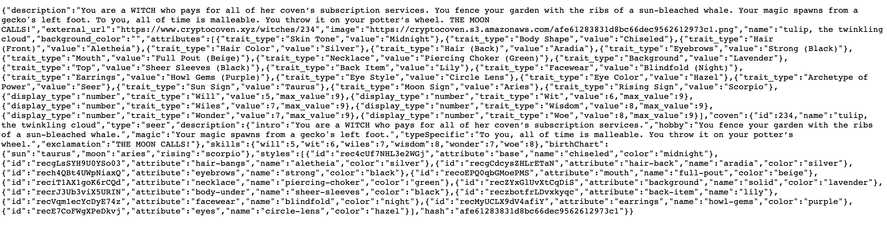

# The Graph Protocol Workshop

By: Nader Dabit, The Graph

[GitHub Repo](https://github.com/dabit3/custom-nft-subgraph-workshop) |
[YouTube Video](https://www.youtube.com/watch?v=XycxuYuJo6M)

# Building a custom NFT API with The Graph

You can use The Graph to create a custom API on top of a smart contract (ERC20 or ERC721) and build an app that works on top of that data layer.

The Graph Protocol calls out to IPFS to get the metadata connected to the base URI of the token id. We can index this and make it query-able.

You can map relations between data types

- bi-directional queries: tokens and their owners or owners and their tokens
- show metadata of nfts
- @entity = allows us to index this type
- @derived = let us do a 1-to-many relationship between a user and the tokens they own
- @fulltext = full text search directive to help us know what we can search for (i.e. only the "Token entity")

# Viewing the CryptoCoven Smart Contract Metadata from IPFS Directly

Link: [https://etherscan.io/address/0x5180db8F5c931aaE63c74266b211F580155ecac8#code](https://etherscan.io/address/0x5180db8F5c931aaE63c74266b211F580155ecac8#code)

Go to the <b>Contract</b> tab and then under <b>Read Contract</b>, you want to find the `getBaseURI` for the contract:

For this example, it's: ipfs://QmSr3vdMuP2fSxWD7S26KzzBWcAN1eNhm4hk1qaR3x3vmj

To get the metadata: ipfs://QmSr3vdMuP2fSxWD7S26KzzBWcAN1eNhm4hk1qaR3x3vmj/234.json

^ This hits the IPFS public gateway, retrieves the metadata, and returns it back for us: like so:



- Returns json object
- metadata of the NFT item

# Setup The Graph to Query NFT Metadata

We will be using the `Subgraph Explorer on the Hosted Service` of The Graph - this is the service we will use to build our custom API

Link: [https://thegraph.com/hosted-service/](https://thegraph.com/hosted-service/)

Two ways to build APIs with The Graph:

- <b>Hosted Service:</b> centralized (OG) service
- <b>Decentralized Network:</b> the web3 way

To interact with an IPFS gateway, you can't do that from the decentralized network...you need ot use the hosted service

Create a subgraph via the dashboard: [https://thegraph.com/hosted-service/dashboard](https://thegraph.com/hosted-service/dashboard)

- Add subgraph
- create link: thegraph.com/hosted-service/brianhhough/ethglobalcryptocovenapi

It will look like this:


Now we will deploy it, but first we need to install the Graph CLI globally using NPM or Yarn to build and deploy our subgraphs

```bash
# Install The Graph Binary:
npm install -g @graphprotocol/graph-cli
# or
yarn global add @graphprotocol/graph-cli
```

To access The Graph Binary:

```bash
npx graph
#
npx graph --help
```

# Initialize a New Subgraph

## From an existing subgraph

```bash
$ graph init --from-example <GITHUB_USERNAME>/<SUBGRAPH_NAME> [<DIRECTORY>]
```

## From an existing smart contract

```bash
$ graph init --from-contract <CONTRACT_ADDRESS> \
  [--network <ETHEREUM_NETWORK>] \
  [--abi <FILE>] \
  <GITHUB_USER>/<SUBGRAPH_NAME> [<DIRECTORY>]
```

This will look like the following for CryptoCoven:

```bash
$ graph init --from-contract 0x5180db8F5c931aaE63c74266b211F580155ecac8 --protocol ethereum \
--network mainnet --contract-name Token --index-events

? Product for which to initialize › hosted-service
? Subgraph name › your-username/cryptocovenapi
? Directory to create the subgraph in › cryptocovenapi
? Ethereum network › Mainnet
? Contract address › 0x5180db8F5c931aaE63c74266b211F580155ecac8
? Contract Name · Token
```

When you run this, it's going to search for the `Contract ABI` from verified contracts on Etherscan

- what we need for boilerplate code for our subgraph
- contract name can be whatever we want it to be

## `schema.graphql`: GraphQL Data Schema

This is where we define our data model

## `subgraph.yaml`: Subgraph YAML File

Defines everything that you need to know about what's happening in our subgraph. Main entry point for indexer who will look to know what's happening in this API.

To get the contract ABI, look for `Code`: https://etherscan.io/address/0x5180db8F5c931aaE63c74266b211F580155ecac8#code

To get the startblock: [https://startblock.vercel.app/](https://startblock.vercel.app/)

For CryptoCoven: `startBlock: 13547115` and we put this into our `subgraph.yaml` file.

^ To note: the startblock is the very FIRST block of the very FIRST transaction in a smart contract. To find this on Etherscan.io, go to `Transactions` and go to the very last page to find which block it's on. You'll see that `startBlock: 13547115` matches the same `13547115` that you see on the very last line of transactions in the list on this [page](https://etherscan.io/txs?a=0x5180db8F5c931aaE63c74266b211F580155ecac8&p=196)

# We are looking for state updates and events on the blockchain

As long as an event is emitted, you can track it for function call and get data.

In ERC721, you have this `Transfer` event that's super powerful: when a token is minted, when it's sold, or when it's transfered from one party to the next.

With a single transfer event, we should be able to get all the data we need.

In our `subgraph.yaml` file: we will call this `handleTransfer` function handler in our subgraph where we write our biz logic that corresponds to the /src/mapping.ts

```graphql
      eventHandlers:
        - event: Transfer(indexed address,indexed address,indexed uint256)
          handler: handleTransfer
```

Use the ABI for this contract with a library to talk to smart contract and get code: `npx graph codegen`


^ this looks at our graphql schema and subgraph.yaml file and generate some code for us. This goes into our /generated folder.

# To deploy our subgraph

Set the deploy key:

```bash
npx graph auth
# Choose hosted-service
# Use your Access Token from the dashboard for your Deploy Key
```

Next we will deploy:

```bash
# at the root folder of the API
yarn deploy
```

This will look like this:


# GraphQL Data Schema Queries with The Graph

Define the schema prams:

```graphql
{
  tokens(first: 5) {
    id
    tokenID
    tokenURI
    externalURL
    image
    description
    name
  }
  users(first: 5) {
    id
    tokens {
      id
    }
  }
}
```

Data will start indexing and we can start querying

Now we can query in the dashboard:


# Full Text Search with The Graph

```graphql
{
  covenSearch(text: "'chaos'") {
    id
    name
    description
  }
}
```

This will reveal tons of results because `chaos` appears in many token's descriptions:

